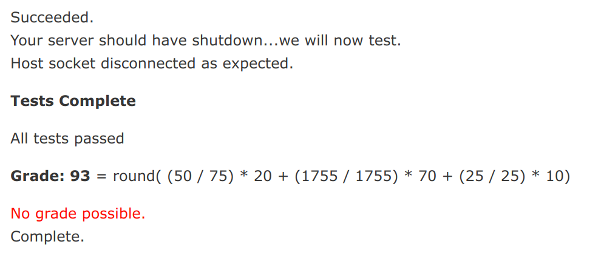

# CS4400 Internet Applications

## Assignment 1: Chat Server

This assignment involved creating a custom-protocol chat server capable of handling multiple clients and multiple chatrooms.

The server uses only standard Python libraries and requires Python3 to run. `./install.sh` ensures Python3 is installed and `./run.sh` starts the server. `run.sh` takes the IP address to listen on as a parameter, defaulting to 0.0.0.0 if no arguments are passed. The server runs on port 3000.

The server currently passes all of the tests.

