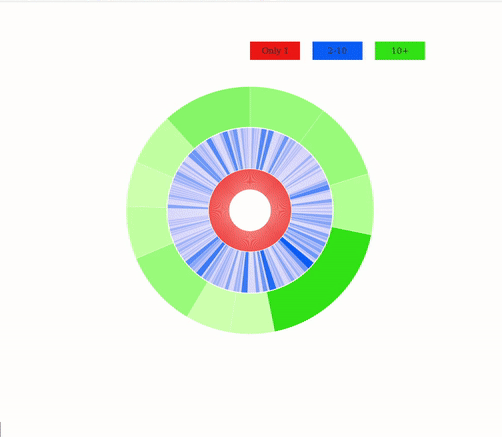

# Spotify 1001 Song Playlist Visualization

Visualization project for Data Visualization class. After the 2017 Wrapped Spotify event, myself a few friends combined the generated playlists of our most played songs into one mega playlist. I created this vis to show all of the artists in the playlist ranked by popularity.

## Requirements
Requires Node.js with the packages outlined in [package.json](package.json).

Navigate to root directory and use `npm install .` to install required packages.

## How the data retrieval works

Note that this process won't work for anyone but me, as it pulls from a hardcoded playlist ID, this readme is purely for anyone interested in how it works. In order to get the data from the Spotify Web API, you first have to authenticate yourself with the app, which has been scripted in [app.js](app.js).

1. Run `node app.js`

2. Open [http://localhost:5050/auth](http://localhost:5050/auth) to be redirected to the Spotify authentication page. Here you give permission for the app to access your account's playlist details.

3. You will be redirected back to localhost, where your Access Token and Refresh Token are displayed on screen and saved locally to tokens.json (secure!).

4. The Access Token is valid for 1 hour. If you need to regenerate the token, go to [http://localhost:5050/refresh](http://localhost:5050/refresh).

5. Go to [http://localhost:5050/artists](http://localhost:5050/artists) to pull down the playlist data and save it to [artists.json](artists.json).

## How to run the vis

1. If on Linux run `npm start` to start server on port 5050 and automatically open your browser.

2. Otherwise run `node index.js` and open [http://localhost:5050/](http://localhost:5050/) in your browser.
